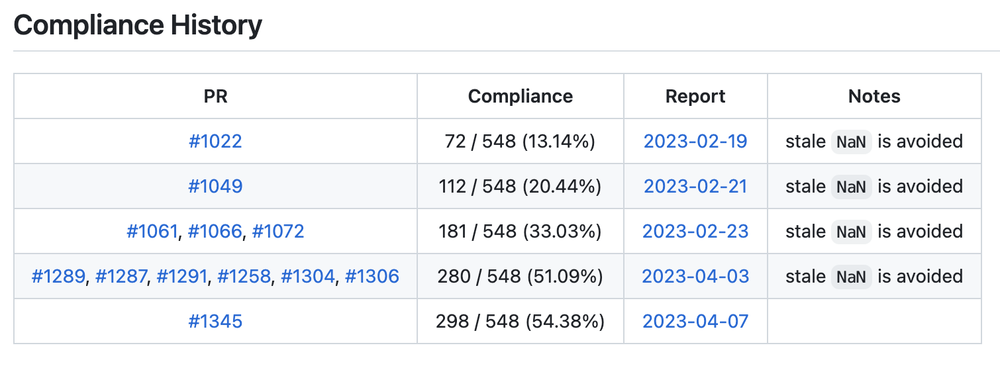

# 2023.03.27 - 2023.04.09 – Support timestamp precision on creating table

April 12, 2023 · 6 min read

## Summary
Together with all our contributors worldwide, we are glad to see GreptimeDB making remarkable progress for the better. Below are some highlights:
- Have passed over **50%** of Prometheus’s compliance tests
- Impl region [manifest checkpoint](https://github.com/GreptimeTeam/greptimedb/issues/170)
- Support timestamp precision on creating table

## Contributor list: (in alphabetical order)
For the past two weeks, our community has been super active with a total of **6 PRs** from 2 contributors merged successfully and lots pending to be merged.
Congrats on becoming our most active contributors in the past 2 weeks:
- [@etolbakov](https://github.com/etolbakov) ([db#1083](https://github.com/GreptimeTeam/greptimedb/pull/1083) [db#1289](https://github.com/GreptimeTeam/greptimedb/pull/1289) [db#1304](https://github.com/GreptimeTeam/greptimedb/pull/1304) [db#1306](https://github.com/GreptimeTeam/greptimedb/pull/1306))
- [@haohuaijin](https://github.com/haohuaijin) ([db#1291](https://github.com/GreptimeTeam/greptimedb/pull/1291) [db#1324](https://github.com/GreptimeTeam/greptimedb/pull/1324))

👏 Let's welcome **@haohuaijin** as the new contributor to join our community and have two PRs merged.

A big THANK YOU for the generous and brilliant contributions! It is people like you who are making GreptimeDB a great product. Let's build an even greater community together.

## Highlights of Recent PR
### [Have passed over **50%** of Prometheus’s compliance tests](https://github.com/GreptimeTeam/greptimedb/pull/1042)
We have initially supported PromQL and passed over **50%** of Prometheus’s compliance tests, which greatly improved PromQL compatibility. To improve its compatibility continuously, we have created this issue and gathered all the PromQL compatibility related PRs and tasks here for easier progress tracking.


<p></p>

### [Impl region manifest checkpoint](https://github.com/GreptimeTeam/greptimedb/pull/1202)
Have you encountered the issue of slow restarts after storing a large amount of data in the database? We have recently fixed this problem.

We have implemented the region manifest checkpoint which compresses manifest actions and creates a snapshot for them. This will decrease disk consumption and speed up region recovery.
Main changes:
  - Region manifest snapshot structures such as `RegionManifestData` and `RegionSnapshot` etc. Please refer to [src/storage/src/manifest/action.rs](https://github.com/GreptimeTeam/greptimedb/blob/develop/src/storage/src/manifest/action.rs).
  - Adds `Checkpointer` trait into `ManifestImpl`.
  - Adds `RegionManifestCheckpointer` to do checkpointing for region manifest. When saving manifest actions, a checkpoint attempt will be made every tenth time.
  - Recovers region manifest from the checkpointed snapshot.

### [Support timestamp precision on creating table](https://github.com/GreptimeTeam/greptimedb/pull/1332)
We have enhanced `Timestamp` to support specifying precision when creating tables, following the [fractional seconds syntax in MySQL](https://dev.mysql.com/doc/refman/8.0/en/fractional-seconds.html).
Fractional seconds option now accepts:
  - 0: no factional seconds, time unit is `TimeUnit::Second`
  - 3: `TimeUnit::Millisecond`
  - 6: `TimeUnit::Microsecond`
  - 9: `TimeUnit::Nanosecond`

Now we can specify the time precision to microseconds like:

```sql
mysql> create table demo (ts timestamp(6) time index, cnt int);
Query OK, 0 rows affected (0.05 sec)
```

And insert timestamps with different time zones:

```sql
mysql> insert into demo(ts,cnt) values ('2023-04-04 08:00:00.52+0000', 1);
Query OK, 1 row affected (0.00 sec)

mysql> insert into demo(ts,cnt) values ('2023-04-04 08:00:00.52+0800', 2);
Query OK, 1 row affected (0.01 sec)
```

All timestamps will be displayed in UTC time:

```sql
mysql> select * from demo order by ts asc;
+------------------------------+------+
| ts                           | cnt  |
+------------------------------+------+
| 2023-04-04 00:00:00.520+0000 |    2 || 2023-04-04 08:00:00.520+0000 |    1 |
+------------------------------+------+
2 rows in set (0.01 sec)
```

This PR modifies timestamps to follow the ISO8601 format when writing query results to the MySQL protocol writer, ensuring that the time zone and fractional parts are displayed.


## New things
- GreptimeDB binaries now ship dashboard UI by default. Start greptimedb and you can find the dashboard at http://localhost:4000/dashboard/
